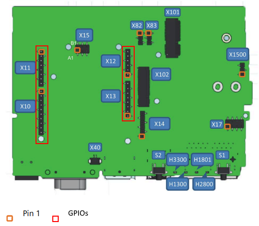

# SIMATIC IOT2050 Interface Examples

> :warning: **Disclaimer:** Be very careful with the following examples. These code snippets are intended to give you an idea of how to implement your own applications and are not intended for one-to-one use.

## Introduction

This document provides a collection of example codes demonstrating how to interface with various GPIO's using the [MRAA library](https://iotdk.intel.com/docs/master/mraa/python/) on the SIMATIC IOT2050. The examples are provided in Python and C++ to cover [Digital Input](#digital-input), [Digital Output](#digital-output), [Analog Input](#analogue-input), [PWM Output](#pwm-output), [I2C](#i2c), [UART](#uart), and [SPI](#spi) interfaces. Furthermore, a specific [interrupt application](#interrupt-by-usr-button) example is provided.

## Requirements

- SIMATIC IOT2050 Basic or SIMATIC IOT2050 Advanced device
- Running IndustrialOS or the Example Images
- MRAA library (pre-)installed on the device
- Development tools for C++ (e.g., g++, make)
- Connected peripherals (as required for each example)
- Keep the GPIO configurations of your `iot2050setup` cli-tool in mind

## Setup Instructions

Before running the examples, ensure that your SIMATIC IOT2050 is set up correctly and that the MRAA library is installed respectively the pre-installed version was not altered. Connect any necessary peripherals (such as sensors, LEDs, or communication modules) to the appropriate pins or ports on the device. Please have a look on the [Documentation](https://iotdk.intel.com/docs/master/mraa/python/) for finding out your desired Pins:



## Example Code Implementations

### Digital Input

The Digital Input example demonstrates how to read the state of a digital input pin on the IOT2050. This can be used for sensing binary states like a button press or a sensor output. The code continuously reads the value of a specified digital pin and prints the result, which will be either high (1) or low (0).

#### C++ Implementation
```cpp
#include <mraa.hpp>
#include <iostream>
#include <unistd.h> // for sleep()

int main() {
    // Initialize a digital pin for input, e.g., pin 6
    mraa::Gpio input_pin(6);

    // Set the pin as an input
    input_pin.dir(mraa::DIR_IN);

    // Read the value of the input pin
    while (true) {
        int value = input_pin.read();
        std::cout << "Input value: " << value << std::endl;
        sleep(1);
    }

    return 0;
}
```

#### Python Implementation
```python
import mraa
import time

# Initialize a digital pin for input, e.g., pin 6
input_pin = mraa.Gpio(6)

# Set the pin as an input
input_pin.dir(mraa.DIR_IN)

# Read the value of the input pin
while True:
    value = input_pin.read()
    print("Input value: ", value)
    time.sleep(1)
```

### Digital Output

The Digital Output example showcases how to control a digital output pin. This is typically used to turn devices like LEDs or relays on and off. The code sets a specified pin as an output and toggles it between high and low states, effectively switching an attached device on and off.

#### C++ Implementation
```cpp
#include <mraa.hpp>
#include <unistd.h> // for sleep()

int main() {
    // Initialize a digital pin for output, e.g., pin 5
    mraa::Gpio output_pin(5);

    // Set the pin as an output
    output_pin.dir(mraa::DIR_OUT);

    // Write a high signal (turn on)
    output_pin.write(1);
    sleep(1); // Keep the signal high for 1 second

    // Write a low signal (turn off)
    output_pin.write(0);
    sleep(1); // Keep the signal low for 1 second

    return 0;
}
```

#### Python Implementation
```python
import mraa
import time

# Initialize a digital pin for input, e.g., pin 6
input_pin = mraa.Gpio(6)

# Set the pin as an input
input_pin.dir(mraa.DIR_IN)

# Read the value of the input pin
while True:
    value = input_pin.read()
    print("Input value: ", value)
    time.sleep(1)
```

### Analogue Input

In the Analog Input example, we demonstrate how to read an analog value from an analog input pin. This is useful for reading values from analog sensors like temperature sensors or potentiometers. The code continuously reads and prints the analog value from a specified pin.

#### C++ Implementation
```cpp
#include <mraa.hpp>
#include <iostream>
#include <unistd.h> // for sleep()

int main() {
    // Initialize an analog pin, e.g., A0
    mraa::Aio analog_pin(0);

    // Read the value of the analog pin
    while (true) {
        int analog_value = analog_pin.read();
        std::cout << "Analog value: " << analog_value << std::endl;
        sleep(1);
    }

    return 0;
}
```

#### Python Implementation
```python
import mraa
import time

# Initialize an analog pin, e.g., A0
analog_pin = mraa.Aio(0)

# Read the value of the analog pin
while True:
    analog_value = analog_pin.read()
    print("Analog value: ", analog_value)
    time.sleep(1)
```

### PWM Output

The PWM Output example illustrates how to generate a Pulse Width Modulation (PWM) signal. PWM is often used for controlling the speed of motors or the brightness of LEDs. The code sets up a PWM pin, specifies its frequency and duty cycle, and then changes the duty cycle after a brief period.

#### C++ Implementation
```cpp
#include <mraa.hpp>
#include <unistd.h> // for sleep()

int main() {
    // Initialize a PWM pin, e.g., pin 3
    mraa::Pwm pwm_pin(3);

    // Enable PWM on the pin
    pwm_pin.enable(true);

    // Set the PWM period, e.g., 1ms
    pwm_pin.period_ms(1);

    // Set the duty cycle, e.g., 50%
    pwm_pin.write(0.5);

    // Change the duty cycle after 2 seconds
    sleep(2);
    pwm_pin.write(0.2);

    return 0;
}
```

#### Python Implementation
```python
import mraa
import time

# Initialize a PWM pin, e.g., pin 3
pwm_pin = mraa.Pwm(3)

# Enable PWM on the pin
pwm_pin.enable(True)

# Set the PWM period, e.g., 1ms
pwm_pin.period_ms(1)

# Set the duty cycle, e.g., 50%
pwm_pin.write(0.5)

# Change the duty cycle after 2 seconds
time.sleep(2)
pwm_pin.write(0.2)
```

### I2C

This I2C example shows how to communicate with devices using the I2C protocol. I2C communication is widely used for interfacing with various sensors and peripherals. The code demonstrates how to read data from a device connected via I2C.

#### C++ Implementation
```cpp
#include <mraa.hpp>
#include <iostream>

int main() {
    // Initialize I2C on bus 0
    mraa::I2c i2c(0);

    // Set the slave address, e.g., 0x77
    i2c.address(0x77);

    // Read 2 bytes from a register, e.g., register 0x01
    uint8_t data[2];
    i2c.readBytesReg(0x01, data, 2);
    std::cout << "Data read from I2C: " << data[0] << " " << data[1] << std::endl;

    return 0;
}
```

#### Python Implementation
```python
import mraa

# Initialize I2C on bus 0
i2c = mraa.I2c(0)

# Set the slave address, e.g., 0x77
i2c.address(0x77)

# Read 2 bytes from a register, e.g., register 0x01
data = i2c.readBytesReg(0x01, 2)
print("Data read from I2C: ", data)
```

### UART

The UART example is focused on demonstrating serial communication using the Universal Asynchronous Receiver-Transmitter (UART) interface. This is commonly used for communication between microcontrollers and computers or other serial devices. The code sends a string over UART and then reads and prints any received data.

#### C++ Implementation
```cpp
#include <mraa.hpp>
#include <iostream>
#include <unistd.h> // for sleep()

int main() {
    // Initialize UART, e.g., UART 0
    mraa::Uart uart(0);

    // Configure UART parameters
    uart.setBaudRate(9600);
    uart.setMode(8, mraa::UART_PARITY_NONE, 1);
    uart.setFlowcontrol(false, false);

    // Write data to UART
    uart.writeStr("Hello UART\n");

    // Read data from UART
    sleep(1);
    if (uart.dataAvailable()) {
        std::string data = uart.readStr(10);
        std::cout << "Data received: " << data << std::endl;
    }

    return 0;
}
```

#### Python Implementation
```python
import mraa
import time

# Initialize UART, e.g., UART 0
uart = mraa.Uart(0)

# Configure UART parameters
uart.setBaudRate(9600)
uart.setMode(8, mraa.UART_PARITY_NONE, 1)
uart.setFlowcontrol(False, False)

# Write data to UART
uart.writeStr("Hello UART\n")

# Read data from UART
time.sleep(1)
if uart.dataAvailable():
    data = uart.readStr(10)
    print("Data received: ", data)
```

### SPI

In the SPI example, we explore how to use the Serial Peripheral Interface (SPI) for communication. SPI is a common method for short-distance communication with sensors and other peripherals. The example includes sending and then immediately reading a byte of data using SPI.

#### C++ Implementation
```cpp
#include <mraa.hpp>
#include <iostream>

int main() {
    // Initialize SPI on bus 0
    mraa::Spi spi(0);

    // Write and read data, e.g., send 0x01 and read one byte
    uint8_t data_to_send[1] = {0x01};
    uint8_t received_data = spi.write(data_to_send[0]);

    std::cout << "Data received from SPI: " << received_data << std::endl;

    return 0;
}
```

#### Python Implementation
```python
import mraa

# Initialize SPI on bus 0
spi = mraa.Spi(0)

# Write and read data, e.g., send 0x01 and read one byte
data_to_send = bytearray([0x01])
received_data = spi.write(data_to_send)

print("Data received from SPI: ", received_data)
```

## Interrupt by USR-Button

This code example for the IOT2050 demonstrating how to set up an interrupt service routine (ISR). It initializes a GPIO pin, linked to the devices USR-Button, as an input, sets its mode, and assigns an interrupt callback function that is triggered when the button connected to the pin is pressed.

#### C++ Implementation
```cpp
import mraa

# Initialize I/Os
pin = 20

# Set up GPIO pin
int_pin = mraa.Gpio(pin)
int_pin.dir(mraa.DIR_IN)          # Set pin direction to input
int_pin.mode(mraa.MODE_PULLUP)    # Enable pull-up resistor

# Define the interrupt callback function
def interrupt_callback(args):
    print("USR Button pressed. My function is now executing. :)")

# Register the interrupt_callback function as an interrupt on the USR button
int_pin.isr(mraa.EDGE_BOTH, interrupt_callback, interrupt_callback)

print("Starting Interrupt Routine on Pin: " + str(pin) + ".")

# Keep the program running to listen for the interrupt
while True:
    pass
```

#### Python Implementation
```python
#include <mraa.hpp>
#include <iostream>

// Interrupt callback function declaration
void interrupt_callback(void* args);

int main() {
    // Initialize USR-Buttin GPIO
    int pin = 20;

    // Set up GPIO pin
    mraa::Gpio int_pin(pin);
    int_pin.dir(mraa::DIR_IN);         // Set pin direction to input
    int_pin.mode(mraa::MODE_PULLUP);   // Enable pull-up resistor

    // Register the interrupt_callback function on the USR button
    int_pin.isr(mraa::EDGE_BOTH, interrupt_callback, NULL);

    std::cout << "Starting Interrupt Routine on Pin: " << pin << "." << std::endl;

    // Keep the program running to listen for the interrupt
    while (true) {
        // Optional: Implement some logic or sleep to reduce CPU usage
    }

    return 0;
}

// Define the interrupt callback function
void interrupt_callback(void* args) {
    std::cout << "USR Button pressed. My function is now executing. :)" << std::endl;
}
```

## Additional Notes
- Ensure that the pin numbers and bus numbers used in the examples match those of your specific hardware setup.
- Be cautious when interfacing with hardware to avoid damaging your SIMATIC IOT2050 or connected devices.
- Some examples may require additional configuration or setup steps specific to your application or hardware.
